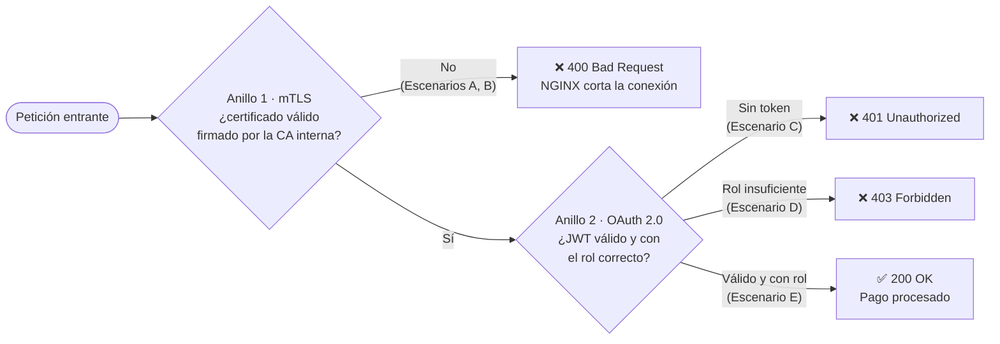
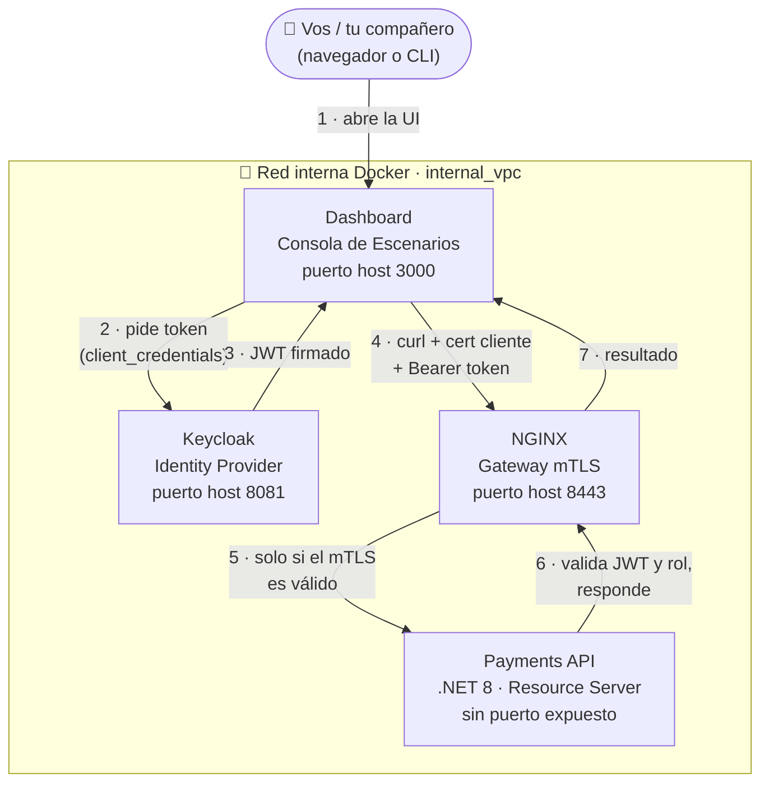

# Zero Trust M2M: PoC de Defensa en Profundidad (mTLS + OAuth 2.0)

Este repositorio implementa una arquitectura **Zero Trust** para comunicaciones máquina a máquina (M2M) utilizando **ASP.NET Core**, **mTLS (Mutual TLS)** y **OAuth 2.0 (Client Credentials Grant)** sobre una red interna simulada con Docker.

## 1. ¿Qué es este experimento?

La idea central de Zero Trust es simple: **nunca confiar en una petición solo porque viene de la red interna**. Acá se ponen a prueba **dos anillos de seguridad independientes**, y una petición tiene que superar ambos para llegar a procesar un pago:

1. **Anillo de Transporte (mTLS):** ¿la petición trae un certificado de cliente válido, firmado por nuestra propia CA? Si no, ni siquiera se establece la conexión TLS — la rechaza NGINX antes de que la petición llegue a la aplicación.
2. **Anillo de Aplicación (OAuth 2.0):** una vez dentro del túnel TLS, ¿trae un token JWT válido, emitido por Keycloak, con el rol (`scope`) que el endpoint exige? Si no, la API lo rechaza aunque la conexión de red sea legítima.

El **Dashboard** (una consola web) permite disparar 5 escenarios que combinan estos dos anillos de distinta forma — desde un atacante sin nada, hasta el flujo legítimo completo — y ver en tiempo real en qué capa exacta se frena (o no) cada intento.



---

## 2. Servicios Levantados

`docker compose up` levanta 4 contenedores conectados por una red interna (`internal_vpc`):

| Servicio | Rol | Puerto (host) | Acceso |
|---|---|---|---|
| **Keycloak** | Identity Provider. Emite los JWT vía `client_credentials`. | `8081` | http://localhost:8081 (admin/admin) |
| **Dashboard** | Consola web: dispara los 5 escenarios y muestra el resultado. | `3000` | http://localhost:3000 |
| **proxy-servicio-b (NGINX)** | Gateway mTLS: único punto de entrada a la API, exige certificado de cliente. | `8443` | https://localhost:8443 |
| **payments-api** | Resource Server (.NET 8). Valida el JWT y las políticas de autorización. | *(sin puerto expuesto al host — solo accesible dentro de `internal_vpc`)* | — |



### Propósito de cada componente

* **Keycloak (Identity Provider):** emite Access Tokens (JWT) mediante el flujo `client_credentials`, configurado con roles granulares (`Payments.Write`, `Reports.Read`).
* **NGINX (mTLS Gateway):** actúa como guardián perimetral L4/L7. Exige y valida criptográficamente que el cliente presente un certificado firmado por la Autoridad Certificadora interna (`PoC-Internal-CA`).
* **Payments API (ASP.NET Core):** Resource Server. No maneja sesiones ni base de datos de usuarios; valida la firma criptográfica del JWT emitido por Keycloak y evalúa políticas de autorización por scopes/roles.
* **Dashboard / Runner:** interfaz de control para disparar solicitudes HTTP manipulando certificados y cabeceras de autorización en tiempo real.

---

## 3. Estructura del Proyecto

```text
zero-trust-poc/
├── README.md                 # Este documento
├── SPEC.md                   # System Prompt / Spec técnica para desarrollo asistido por IA
├── docker-compose.yaml       # Orquestación de toda la topología de red y servicios
├── Makefile                  # Automatización de tareas (setup, build, up, test, clean)
├── scripts/
│   ├── generate-certs.sh     # Generación automatizada de CA, servidores y clientes (legítimo y rogue)
│   └── run-scenarios.sh      # Suite de pruebas CLI para simular los escenarios A, B, C, D y E
├── certs/                    # Almacén de llaves y certificados x509 (regenerable, ignorado por git)
├── config/
│   ├── nginx.conf            # Configuración de terminación mTLS y reverse proxy
│   └── keycloak/
│       └── realm-export.json # Realm preconfigurado con clientes, roles y scopes
└── src/
    ├── PaymentsApi/           # Resource Server en .NET 8 / Minimal API con JwtBearer
    │   ├── PaymentsApi.csproj
    │   ├── Program.cs
    │   └── Dockerfile
    └── Dashboard/              # Web UI interactiva para ejecutar escenarios y visualizar el flujo
        ├── package.json
        ├── server.js          # Backend ligero en Node.js que ejecuta los curls contra la red interna
        ├── public/
        │   └── index.html     # Visualizador interactivo de tráfico L4/L7
        └── Dockerfile
```

---

## 4. Matriz de Escenarios de Penetración

| Escenario | Certificado TLS Cliente | Access Token JWT | Capa Evaluada | Resultado Esperado | Explicación Técnica |
|---|---|---|---|---|---|
| **A: Intrusión Directa** | Ninguno | Ninguno | Transporte (L4/L7) | `400 Bad Request` | NGINX rechaza el handshake TLS antes de rutear la petición. La API jamás se entera. |
| **B: Certificado Falsificado** | Firmado por CA Externa | Ninguno | Transporte (L4/L7) | `400 Bad Request` | Fallo de validación en la cadena de confianza (`certificate verify failed`). |
| **C: Máquina Comprometida** | Certificado Legítimo | Ninguno | Aplicación (L7) | `401 Unauthorized` | El túnel TLS es válido, pero el middleware `JwtBearer` en .NET bloquea la llamada por falta de token. |
| **D: Privilegios Insuficientes** | Certificado Legítimo | Token con `Reports.Read` | Aplicación (L7) | `403 Forbidden` | Identidad de aplicación válida, pero el endpoint exige la política `RequirePaymentsWrite`. |
| **E: Flujo Legítimo** | Certificado Legítimo | Token con `Payments.Write` | Transporte + App | `200 OK / 201 Created` | Ambos anillos de seguridad superados exitosamente. |

---

## 5. Requisitos Previos

* **Docker** y **Docker Compose** (`docker compose version`).
* **OpenSSL** — genera los certificados en el host antes de levantar los contenedores.
* **jq** y **curl** — solo necesarios para `make test` (la suite CLI). El Dashboard web no los requiere en el host.

## 6. Guía Rápida de Ejecución

```bash
# 1. Clonar el repositorio
git clone <repo-url> && cd zero-trust-poc

# 2. Generar certificados e iniciar todos los servicios
make setup
make up

# 3. Acceder al Dashboard Interactivo
open http://localhost:3000

# 4. O ejecutar las pruebas vía CLI
make test

# 5. Apagar todo (borra contenedores y volúmenes)
make down
```
